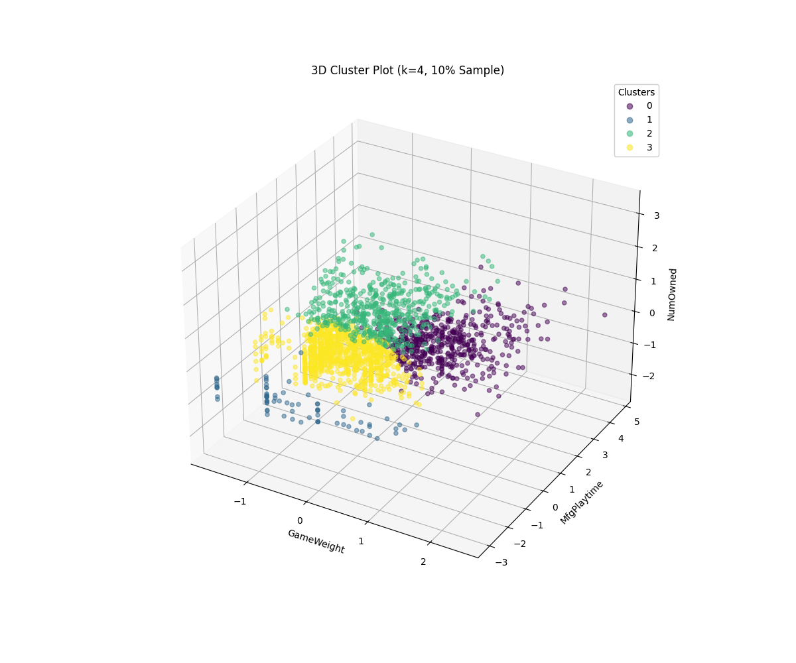

# Data Mining - Module 1: Board Game Clustering

This is a project for the Data Mining course at the University of Pisa. This repository contains the mid-term project, which covers a complete analysis of the "Board Games Dataset".

The project performs:
1.  **Data Understanding & Preparation:** A full analysis of the raw data, including cleaning, imputation of missing values, log-transformation of skewed data, and scaling using `RobustScaler`.
2.  **Clustering:** A "bake-off" between all three mandatory clustering algorithms (K-Means, DBSCAN, and Hierarchical) to find the best model.

---

## 🏆 Final Conclusion

After a full analysis and experimentation, the best model was **K-Means with k=4** on a **3-feature set** (`GameWeight`, `MfgPlaytime`, `NumOwned`).

This model achieved a **Silhouette Score of 0.357**, which was a **98% improvement** over the baseline K-Means model (which used all 32 features and scored 0.180).

The other mandatory algorithms, DBSCAN and Hierarchical Clustering, were found to be a poor fit for this dataset (scores of -0.322 and 0.337, respectively).

---

## 🚀 How to Run

1.  Place the raw dataset folder (`dm1_25_26_dataset/`) in the same root directory as the scripts.
2.  Run `task_1_analysis.py` to generate all analysis plots (histograms, correlation matrices, etc.) into the `analysis_plots/` folder.
3.  Run `task_2_analysis.py` to perform the full data preparation. This will create the clean `dm1_prepared_dataset.csv`.
4.  Run the clustering scripts to reproduce the results:
    * `task_3_k-cluster_full-features.py` (Baseline model, score: 0.180)
    * `task_3_k-cluster_selected-features.py` (**Winning model**, score: 0.357)
    * `task_3_dbscan.py` (Failed model, score: -0.322)
    * `task_3_hierarchical-clustering.py` (Runner-up model, score: 0.337)

---

## 🗂️ Project Structure

* **`task_1_analysis.py`**: Analyzes the raw dataset, calculates skewness, kurtosis, correlations, and outliers. Saves all analysis plots to `analysis_plots/`.
* **`task_2_analysis.py`**: Cleans and prepares the raw data. Imputes missing values, drops redundant columns, applies a log-transform to skewed data, and scales all features using `RobustScaler`. Outputs the final `dm1_prepared_dataset.csv`.
* **`task_3_k-cluster_full-features.py`**: Our baseline K-Means run on all 32 features.
* **`task_3_k-cluster_selected-features.py`**: Our **winning** K-Means run on the 3 selected features. Generates the final 3D scatter plot and centroid plot.
* **`task_3_dbscan.py`**: Our DBSCAN analysis. Uses a k-distance plot to find `eps` and proves the model is a poor fit for the data.
* **`task_3_hierarchical-clustering.py`**: Our Hierarchical analysis. Run on the same 3 features for a fair comparison against K-Means.
* **`analysis_plots/`**: Folder containing all plots from the Task 1 analysis.
* **`clustering_plots/`**: Folder containing all plots from the Task 3 clustering (Elbow plots, dendrograms, centroid plots, etc.).
* **`Project_Bushpepa.pdf`**: The final LaTeX report summarizing all findings.
